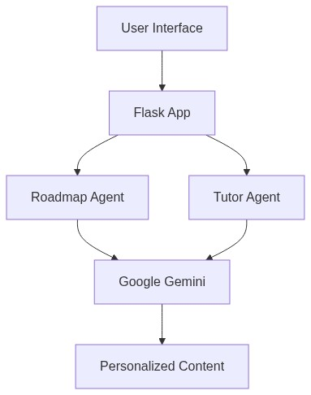
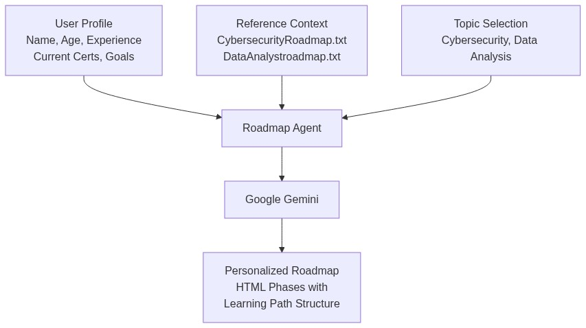
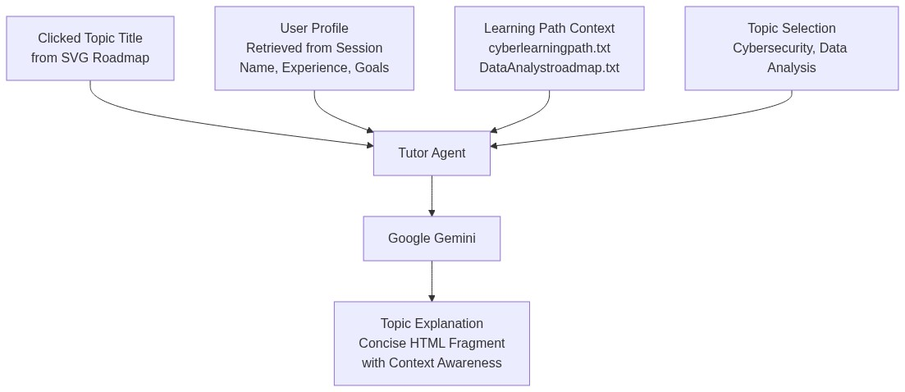
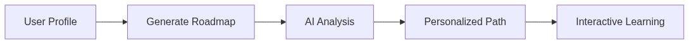
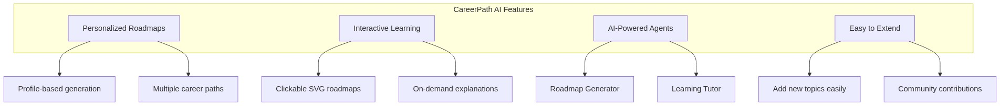
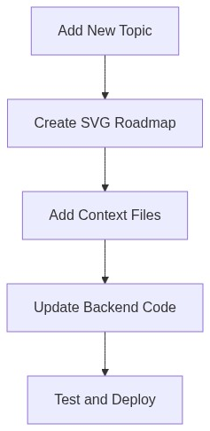

# CareerPath AI – Certification Roadmap & Interactive Tutor

A Flask app that generates personalized certification roadmaps (e.g., Cybersecurity, Data Analysis) using Google Gemini and teaches topics via an interactive roadmap (SVG) with click‑to‑explain.

## 🏗️ Architecture Overview



The system consists of two main AI agents working together:
- **Roadmap Agent**: Generates personalized learning paths based on user profiles
- **Tutor Agent**: Provides on-demand explanations for specific topics

### 🗺️ Roadmap Agent Flow


### 🎓 Tutor Agent Flow


## 🔄 How It Works



1. **User Profile**: Enter your background, experience, and goals
2. **Generate Roadmap**: AI creates a personalized certification path
3. **AI Analysis**: Google Gemini processes your profile with domain expertise
4. **Personalized Path**: Get a custom roadmap with phases and milestones
5. **Interactive Learning**: Click on topics in the SVG roadmap for detailed explanations

## Project layout

```
Cerfication Roadmap/
├─ CareerPath/
│  ├─ app.py                 # Main Flask app (production entry)
│  ├─ requirements.txt       # Python deps
│  ├─ templates/
│  │  └─ index.html          # Main UI (form + modal; links to static roadmaps)
│  ├─ static/
│  │  ├─ cybersecurity.html  # Interactive SVG roadmap
│  │  ├─ aiengineer.html
│  │  ├─ datascience.html
│  │  └─ style.css
│  └─ data/
│     ├─ CybersecurityRoadmap.txt   # Roadmap agent reference (generation)
│     ├─ cyberlearningpath.txt      # Tutor agent context (explanations)
│     └─ DataAnalystroadmap.txt     # Data‑analysis roadmap/tutor context
├─ Procfile                  # web: gunicorn CareerPath.app:app
└─ README.md
```

## What it does

- Roadmap agent (GET `/recommend`):
  - Takes profile (name, age, experience, current_certs, interest, timeframe, topic).
  - Reads topic reference file (e.g., `data/CybersecurityRoadmap.txt`).
  - Prompts Gemini to return an HTML fragment with phases wrapped in `<div class="roadmap-phase">…</div>`.
- Tutor agent (GET `/explain-node`):
  - Triggered when the user clicks a topic in an SVG roadmap.
  - Uses the clicked `title`, user profile from session, and a topic learning‑path file (e.g., `data/cyberlearningpath.txt`).
  - Prompts Gemini to return a concise HTML fragment to display in a modal.

## Prerequisites
- Python 3.10+
- Google AI Studio API key with access to `gemini-2.0-flash`

## Setup (Windows PowerShell)
```
cd "C:\Users\Ibrah\Desktop\Cerfication Roadmap\CareerPath"
python -m venv .venv
.\.venv\Scripts\Activate.ps1
pip install -r requirements.txt

$env:GENAI_API_KEY = "<YOUR_GOOGLE_AI_KEY>"
$env:FLASK_SECRET_KEY = "<random-hex>"  # python -c "import secrets;print(secrets.token_hex(32))"

python app.py
```

Production (via Procfile):
```
web: gunicorn CareerPath.app:app
```

## 🚀 Features



- **Multi-Topic Support**: Cybersecurity, Data Analysis, AI Engineering
- **Personalized Generation**: AI adapts to your experience level and goals
- **Interactive Learning**: Click-to-learn with contextual explanations
- **Progressive Disclosure**: Learn at your own pace with detailed breakdowns
- **Extensible**: Easy to add new topics and roadmaps

## 🤝 Add a new roadmap/topic



To support a new topic (e.g., AI Engineering), add three things and one tiny code change.

1) Provide an interactive roadmap SVG page
- Create `CareerPath/static/<topic>.html` that contains the SVG with clickable nodes (`<g data-title="...">` per node).
- The Topic selector in `templates/index.html` already updates the "Learn Roadmap" button. Add a new `<option value="<topic>">` and ensure the JS maps it to your new file.

2) Add text files for model grounding
- Roadmap generation reference (optional, high-level cert plan used by the generator):
  - `CareerPath/data/<Topic>Roadmap.txt` (e.g., `AiEngineerRoadmap.txt`)
- Tutor learning‑path (required; granular topics list that mirrors the SVG):
  - `CareerPath/data/<topic>learningpath.txt` (e.g., `ailearningpath.txt`)
  - Include the numbered topics/sections you expect in the SVG.

3) Wire the backend to the new files
- In `CareerPath/app.py`, extend the small conditionals:

```python
# /recommend → reference_context
elif topic == "ai-engineering":
    with open((DATA_DIR / "AiEngineerRoadmap.txt"), "r", encoding="utf-8") as f:
        reference_context = f.read().strip()

# /explain-node → learningpath_context
elif topic == "ai-engineering":
    with open((DATA_DIR / "ailearningpath.txt"), "r", encoding="utf-8") as f:
        learningpath_context = f.read().strip()
```

4) Test
- Generate a roadmap for the new topic and click nodes in the SVG to verify explanations appear.

## Contributing
- Keep contributions scoped to `CareerPath/`.
- For each new topic, submit:
  - Static SVG page under `static/`
  - Two text files under `data/` (roadmap reference optional; learning path required)
  - Minimal edits in `app.py` to load those files
  - Optional UI changes in `templates/index.html`

## Security
- Do not commit secrets. Set `GENAI_API_KEY` and `FLASK_SECRET_KEY` via environment variables.
- Changing `FLASK_SECRET_KEY` will log out active sessions.

## Notes
- The app returns HTML fragments from Gemini; the server does no post‑processing. Ensure prompts request structural elements (`<div class="roadmap-phase">`, `<h2>`, `<ul>`).
- The modal explanation will render either a top‑level `#explanation` fragment or the full returned HTML.
